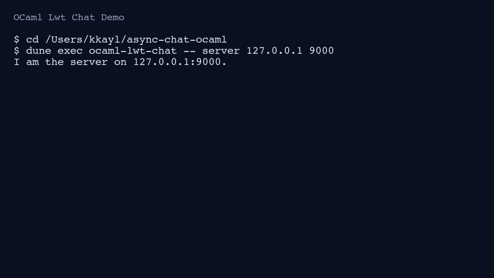

# OCaml Lwt Chat

A small terminal-based TCP chat server and client written in OCaml with Lwt.
It supports multiple concurrent clients and message broadcast over a shared
server connection.

## Highlights

- Uses cooperative concurrency (`Lwt`) for non-blocking networking.
- Uses a lock-protected client registry and prunes failed writers safely.
- Separates CLI parsing from runtime behavior for testability.
- Validates CLI input (mode, IP, and port range) with explicit error messages.
- Includes deterministic OUnit tests for parsing and formatting paths.
- Uses Dune for reproducible build and test workflows.

## Build, run, test

```sh
dune build
dune exec ocaml-lwt-chat -- server 127.0.0.1 9000
dune exec ocaml-lwt-chat -- client 127.0.0.1 9000 "alice"
dune test
```

## Demo



## Example usage

Start a server in one terminal:

```sh
dune exec ocaml-lwt-chat -- server 127.0.0.1 9000
```

Join from another terminal:

```sh
dune exec ocaml-lwt-chat -- client 127.0.0.1 9000 "alice"
```

Join from a third terminal:

```sh
dune exec ocaml-lwt-chat -- client 127.0.0.1 9000 "bob"
```

Messages typed by each client are broadcast to other connected clients.

## Project structure

- `lib/chat_app.ml`: CLI parsing, server/client runtime, and broadcast logic.
- `bin/main.ml`: command-line entrypoint and error handling.
- `test/test_chat.ml`: unit tests for usage, sockaddr rendering, and CLI parsing.

## Quality checks

- Formatting: `dune fmt`
- Build: `dune build`
- Tests: `dune test`
- CI: GitHub Actions workflow at `.github/workflows/ci.yml`

Originally written for coursework and later revisited to improve structure,
tests, and documentation.
